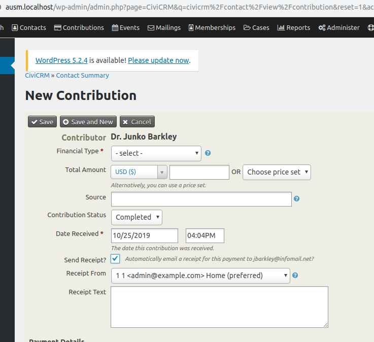

# com.aghstrategies.receipttext

Adds a "Receipt Text" field to Offline Contribution Forms (both "New Contribution" and "New Credit Card Contribution") that displays when the "Send Receipt?" checkbox is checked. The text entered into the "Receipt Text" field is displayed in the receipt. More documentation in https://github.com/civicrm/civicrm-core/pull/15605



The extension is licensed under [AGPL-3.0](LICENSE.txt).

## Requirements

* PHP v7.0+
* CiviCRM 5.24

## Installation (Web UI)

This extension has not yet been published for installation via the web UI.

## Installation (CLI, Zip)

Sysadmins and developers may download the `.zip` file for this extension and
install it with the command-line tool [cv](https://github.com/civicrm/cv).

```bash
cd <extension-dir>
cv dl com.aghstrategies.receipttext@https://github.com/FIXME/com.aghstrategies.receipttext/archive/master.zip
```

## Installation (CLI, Git)

Sysadmins and developers may clone the [Git](https://en.wikipedia.org/wiki/Git) repo for this extension and
install it with the command-line tool [cv](https://github.com/civicrm/cv).

```bash
git clone https://github.com/FIXME/com.aghstrategies.receipttext.git
cv en receipttext
```

## Usage

1. Navigate to the Contact Summary of a contact with an email address.
2. Go to the Contribution tab
3. Click "New Contribution" or "New Credit Card Contribution"
4. Check the "Send Receipt?" box

### Before
No Receipt Text field

### After
A Receipt Text field should appear, when populated the text should appear in the receipt wherever the {$receipt_text} token is.

## Known Issues

None
